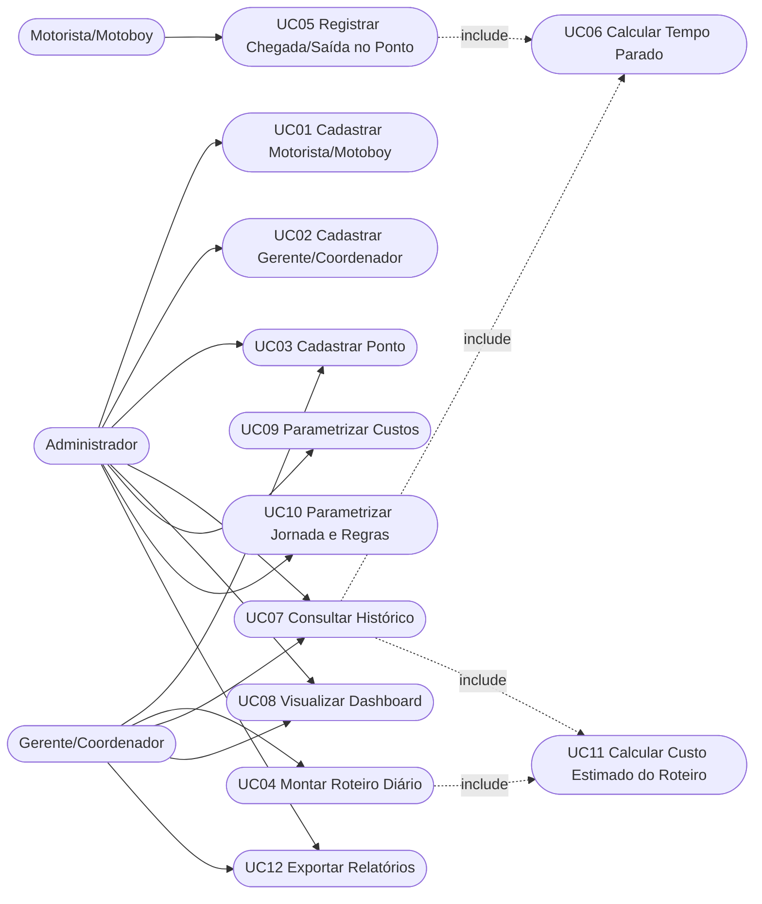
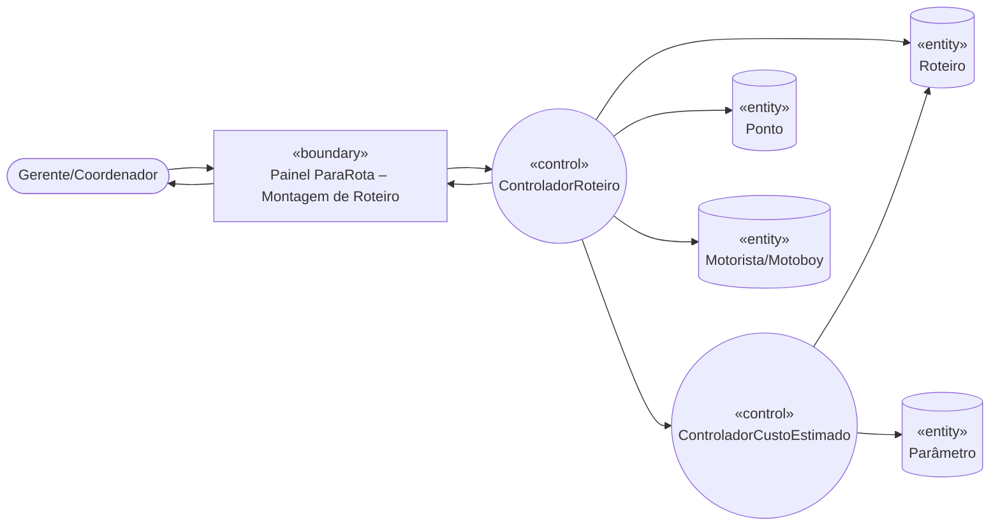
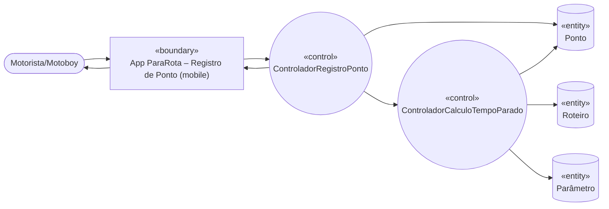
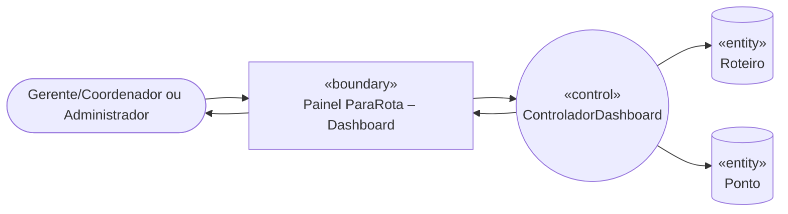
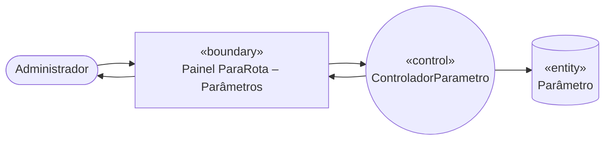
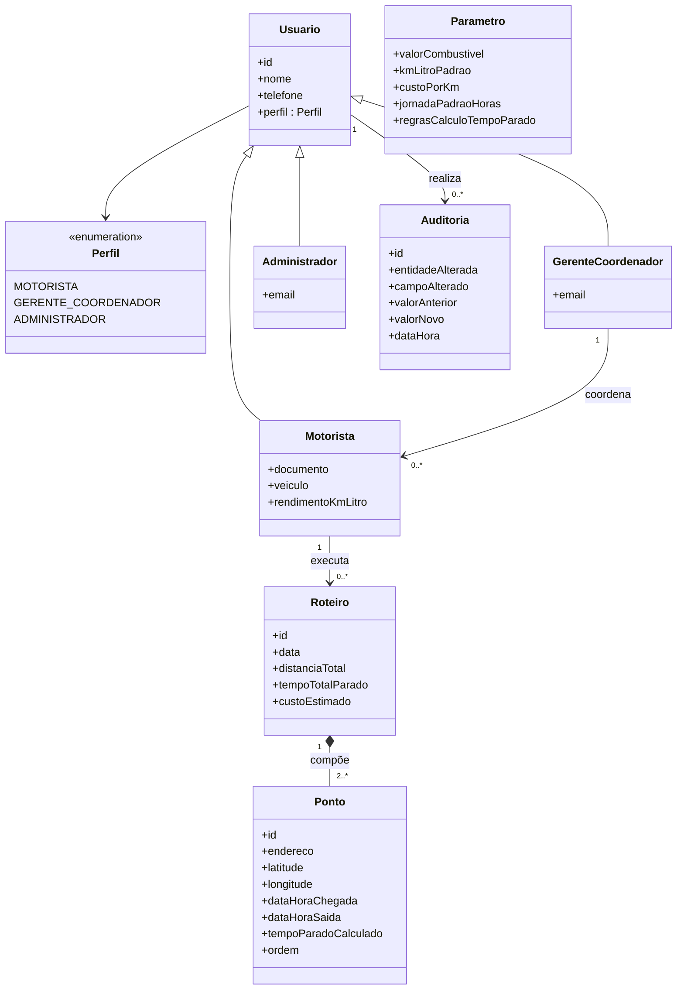

# ParaRota: Monitoramento de Tempo Parado em Roteiros

2026-09-17 · Daniel Matos Marques

ParaRota é o MVP de monitoramento de tempo parado em roteiros de entrega. Este documento traz a especificação de casos de uso, diagrama de robustez e diagrama de classes conceitual da 1ª parte do projeto.

## 1. Casos de Uso

### 1.1 Atores

- **Motorista/Motoboy** — profissional de campo que executa o roteiro diário e registra chegada/saída em cada ponto.
- **Gerente/Coordenador** — monta roteiros, consulta histórico e dashboard, e exporta relatórios.
- **Administrador** — realiza cadastros gerais, parametriza custos, jornada e regras de cálculo, e controla acesso por perfil (RNF04).

### 1.2 Diagrama de Casos de Uso

### 1.3 Especificação dos Casos de Uso

#### UC01 — Cadastrar Motorista/Motoboy

- **Ator principal:** Administrador. **Ator secundário:** Gerente/Coordenador.
- **Pré-condições:** usuário autenticado com perfil Administrador ou Gerente/Coordenador.
- **Pós-condições:** motorista/motoboy cadastrado e disponível para associação a roteiros.
- **Fluxo principal:**
  1. O ator seleciona "Novo motorista/motoboy".
  2. O sistema exibe o formulário de cadastro.
  3. O ator informa nome, telefone, documento, dados do veículo e rendimento km/litro.
  4. O sistema valida os dados informados.
  5. O sistema persiste o cadastro e exibe confirmação.
- **Fluxos alternativos:** A1 — Editar cadastro existente: no passo 1 o ator seleciona um motorista já cadastrado; o sistema carrega os dados; o fluxo retoma no passo 3.
- **Fluxos de exceção:** E1 — Dados inválidos ou documento duplicado: no passo 4 o sistema exibe erro e retorna ao passo 3.
- **Regras relacionadas:** —

#### UC02 — Cadastrar Gerente/Coordenador

- **Ator principal:** Administrador.
- **Pré-condições:** usuário autenticado com perfil Administrador.
- **Pós-condições:** gerente/coordenador cadastrado e apto a autenticar-se.
- **Fluxo principal:**
  1. O Administrador seleciona "Novo gerente/coordenador".
  2. O sistema exibe o formulário.
  3. O Administrador informa nome, telefone, e-mail e equipe sob responsabilidade.
  4. O sistema valida os dados e verifica unicidade do e-mail.
  5. O sistema persiste o cadastro, define o perfil de acesso e exibe confirmação.
- **Fluxos alternativos:** A1 — Editar cadastro existente (análogo ao UC01-A1).
- **Fluxos de exceção:** E1 — E-mail já cadastrado: o sistema exibe erro e retorna ao passo 3.
- **Regras relacionadas:** RNF04.

#### UC03 — Cadastrar Ponto

- **Ator principal:** Gerente/Coordenador. **Ator secundário:** Administrador.
- **Pré-condições:** usuário autenticado.
- **Pós-condições:** ponto cadastrado com endereço e coordenadas, disponível para compor roteiros.
- **Fluxo principal:**
  1. O ator seleciona "Novo ponto".
  2. O sistema exibe o formulário de cadastro do ponto.
  3. O ator informa o endereço; o sistema geocodifica e sugere latitude/longitude.
  4. O ator confirma ou ajusta as coordenadas.
  5. O sistema valida e persiste o ponto.
- **Fluxos alternativos:** A1 — Geocodificação indisponível: o ator informa a coordenada manualmente; o fluxo retoma no passo 5.
- **Fluxos de exceção:** E1 — Endereço inválido ou incompleto: o sistema exibe erro e retorna ao passo 3.
- **Regras relacionadas:** —

#### UC04 — Montar Roteiro Diário

- **Ator principal:** Gerente/Coordenador.
- **Pré-condições:** existência de ao menos um motorista/motoboy e de pontos cadastrados.
- **Pós-condições:** roteiro criado, associado a um único motorista e a uma única data, com pontos em ordem sequencial.
- **Fluxo principal:**
  1. O Gerente seleciona "Novo roteiro".
  2. O sistema solicita a data e o motorista/motoboy responsável.
  3. O Gerente seleciona os pontos que compõem o roteiro.
  4. O sistema numera os pontos na ordem de seleção (1, 2, 3...), conforme RN06.
  5. O Gerente confirma a montagem do roteiro.
  6. O sistema persiste o roteiro e inclui UC11 para apresentar o custo estimado.
- **Fluxos alternativos:** A1 — Reordenar pontos: antes da confirmação, o Gerente arrasta um ponto para nova posição; o sistema renumera a sequência.
- **Fluxos de exceção:** E1 — Motorista já possui roteiro na mesma data: o sistema impede a gravação (RN05). E2 — Roteiro com menos de 2 pontos: o sistema impede a confirmação.
- **Regras relacionadas:** RN05, RN06.

#### UC05 — Registrar Chegada/Saída no Ponto

- **Ator principal:** Motorista/Motoboy.
- **Pré-condições:** roteiro do dia montado e atribuído ao motorista.
- **Pós-condições:** horários de chegada e saída registrados; UC06 disparado para recalcular o tempo parado.
- **Fluxo principal:**
  1. O Motorista abre o roteiro do dia no dispositivo móvel.
  2. O sistema exibe a lista de pontos em ordem sequencial.
  3. O Motorista seleciona o ponto atual e registra o horário de chegada.
  4. Ao concluir a parada, registra o horário de saída.
  5. O sistema inclui UC06 para o ponto registrado.
  6. O sistema persiste os horários e atualiza o status do ponto.
- **Fluxos alternativos:** A1 — Primeiro ponto do roteiro (partida): o sistema registra chegada/saída, mas não computa tempo parado (RN01).
- **Fluxos de exceção:** E1 — Registro de saída sem chegada prévia: o sistema impede o registro.
- **Regras relacionadas:** RN01, RN02.

#### UC06 — Calcular Tempo Parado (por ponto e por roteiro)

- **Ator principal:** Sistema (incluído por UC05 e UC07).
- **Pré-condições:** horários de chegada e saída registrados em ao menos um ponto.
- **Pós-condições:** tempo parado do ponto e do roteiro atualizados.
- **Fluxo principal:**
  1. O sistema identifica se o ponto é o ponto de partida.
  2. Se não for partida, calcula o tempo parado do ponto (saída − chegada), RN02.
  3. O sistema soma os tempos parados de todos os pontos, exceto a partida (RN03).
  4. O sistema calcula o percentual do tempo parado em relação à jornada padrão de 8h (RN04).
  5. O sistema atualiza os indicadores do roteiro e do dashboard.
- **Fluxos alternativos:** —
- **Fluxos de exceção:** E1 — Ponto de partida: não computa tempo parado (RN01) e o fluxo é encerrado.
- **Regras relacionadas:** RN01, RN02, RN03, RN04.

#### UC07 — Consultar Histórico de Pontos e Tempos Parados

- **Ator principal:** Gerente/Coordenador. **Ator secundário:** Administrador.
- **Pré-condições:** usuário autenticado; roteiros já executados no período.
- **Pós-condições:** histórico de pontos, endereços e tempos parados exibido para o período.
- **Fluxo principal:**
  1. O ator informa o período de consulta.
  2. O sistema inclui UC06 caso existam pontos não recalculados.
  3. O sistema apresenta a lista de pontos, endereço, data/hora e tempo parado.
  4. O ator pode filtrar por motorista, roteiro ou ponto.
- **Fluxos alternativos:** A1 — Nenhum registro no período: o sistema exibe mensagem informativa.
- **Fluxos de exceção:** —
- **Regras relacionadas:** RN01, RN02, RN03.

#### UC08 — Visualizar Dashboard de Tempo Parado

- **Ator principal:** Gerente/Coordenador. **Ator secundário:** Administrador.
- **Pré-condições:** usuário autenticado; roteiros com tempos parados calculados.
- **Pós-condições:** gráficos de tempo parado por dia, mês e período exibidos.
- **Fluxo principal:**
  1. O ator acessa o dashboard.
  2. O sistema apresenta gráficos de tempo parado por dia, mês e período, associados aos pontos do roteiro (RF08).
  3. O ator seleciona um recorte e, opcionalmente, filtra por motorista ou roteiro.
  4. O sistema atualiza os gráficos em até 3 segundos para consultas de até 12 meses (RNF03).
- **Fluxos alternativos:** —
- **Fluxos de exceção:** E1 — Tempo de resposta excedido: o sistema exibe carregamento e mantém a última visualização válida.
- **Regras relacionadas:** RN03, RN04, RNF03.

#### UC09 — Parametrizar Custos

- **Ator principal:** Administrador.
- **Pré-condições:** usuário autenticado com perfil Administrador.
- **Pós-condições:** valor do combustível, km/litro padrão e custo por km atualizados sem alteração de código.
- **Fluxo principal:**
  1. O Administrador acessa a tela de parâmetros de custo.
  2. O sistema exibe os valores vigentes.
  3. O Administrador altera os valores.
  4. O sistema valida e persiste os novos parâmetros.
- **Fluxos alternativos:** —
- **Fluxos de exceção:** E1 — Valor negativo ou inválido: o sistema rejeita a alteração.
- **Regras relacionadas:** RN07.

#### UC10 — Parametrizar Jornada e Regras de Cálculo do Tempo Parado

- **Ator principal:** Administrador.
- **Pré-condições:** usuário autenticado com perfil Administrador.
- **Pós-condições:** jornada padrão (8h/dia) e regras de cálculo atualizadas.
- **Fluxo principal:**
  1. O Administrador acessa a tela de parâmetros de jornada e regras.
  2. O sistema exibe a jornada e regras vigentes.
  3. O Administrador altera os valores.
  4. O sistema valida e persiste os novos parâmetros.
- **Fluxos alternativos:** —
- **Fluxos de exceção:** E1 — Jornada igual a zero ou negativa: o sistema rejeita a alteração.
- **Regras relacionadas:** RN04.

#### UC11 — Calcular Custo Estimado do Roteiro

- **Ator principal:** Sistema (incluído por UC04 e UC07).
- **Pré-condições:** parâmetros de custo cadastrados (UC09); roteiro com distância percorrida definida.
- **Pós-condições:** custo estimado do roteiro calculado e associado ao roteiro.
- **Fluxo principal:**
  1. O sistema obtém a distância total do roteiro.
  2. O sistema obtém o valor do combustível e o rendimento km/litro do veículo.
  3. O sistema calcula o custo estimado (RN07).
  4. O sistema associa o custo estimado ao roteiro.
- **Fluxos alternativos:** —
- **Fluxos de exceção:** E1 — Parâmetros de custo não cadastrados: o sistema alerta e mantém o custo em branco até a parametrização (UC09).
- **Regras relacionadas:** RN07.

#### UC12 — Exportar Relatórios

- **Ator principal:** Gerente/Coordenador. **Ator secundário:** Administrador.
- **Pré-condições:** consulta de histórico (UC07) ou dashboard (UC08) já realizada para o período desejado.
- **Pós-condições:** relatório do período gerado em arquivo para download.
- **Fluxo principal:**
  1. O ator seleciona "Exportar relatório" a partir do histórico ou do dashboard.
  2. O sistema solicita o formato de exportação.
  3. O sistema gera o arquivo com os dados do período consultado.
  4. O sistema disponibiliza o arquivo para download.
- **Fluxos alternativos:** —
- **Fluxos de exceção:** E1 — Período sem dados: o sistema informa ausência de dados.
- **Regras relacionadas:** —

### 1.4 Rastreabilidade Requisito × Caso de Uso

| Requisito | Caso de Uso |
| --- | --- |
| RF01 | UC01 |
| RF02 | UC02 |
| RF03 | UC03 |
| RF04 | UC04 |
| RF05 | UC05 |
| RF06 | UC06 |
| RF07 | UC07 |
| RF08 | UC08 |
| RF09 | UC09 |
| RF10 | UC10 |
| RF11 | UC11 |
| RF12 | UC12 |

## 2. Diagrama de Robustez

Os diagramas a seguir traduzem os casos de uso de maior prioridade em objetos de fronteira («boundary»), controle («control») e entidade («entity»), evidenciando a interação entre interface, lógica de aplicação e dados persistidos.

### 2.1 UC04 — Montar Roteiro Diário

O Gerente aciona a tela de montagem; o `ControladorRoteiro` valida motorista, data (RN05) e ordena os pontos selecionados (RN06), persiste o `Roteiro` e delega ao `ControladorCustoEstimado` (UC11) o cálculo do custo, que lê os `Parâmetro` de custo vigentes.

### 2.2 UC05/UC06 — Registrar Chegada/Saída e Calcular Tempo Parado

O `ControladorRegistroPonto` grava chegada/saída no `Ponto`; ao concluir, delega ao `ControladorCalculoTempoParado`, que aplica RN01-RN02 no `Ponto`, atualiza o total em `Roteiro` (RN03) e lê a jornada padrão em `Parâmetro` (RN04).

### 2.3 UC08 — Visualizar Dashboard de Tempo Parado

O `ControladorDashboard` lê tempos parados agregados em `Roteiro` e por endereço em `Ponto`, montando os gráficos por dia, mês e período (RF08) em até 3s (RNF03).

### 2.4 UC09/UC10 — Parametrizar Custos, Jornada e Regras de Cálculo

O `ControladorParametro` valida e persiste valor do combustível, rendimento km/litro, custo por km, jornada padrão (8h/dia) e regras de cálculo do tempo parado (RN07, critério de aceitação de parametrização sem alteração de código).

## 3. Diagrama de Classes Conceitual

O modelo conceitual parte das entidades do item 8 da especificação (Ponto, Roteiro, Motorista/Motoboy, Gerente/Coordenador, Parâmetro), acrescentando uma superclasse `Usuario` (para suportar o controle de acesso por perfil, RNF04) e a entidade `Auditoria` (RNF05).

### Cardinalidades e regras representadas

| Relacionamento | Cardinalidade | Regra de negócio |
| --- | --- | --- |
| Motorista → Roteiro | 1 para 0..\* | RN05 — cada roteiro pertence a um único motorista e a uma única data |
| Roteiro → Ponto | 1 para 2..\* | RN06 — pontos possuem ordem sequencial (mínimo: partida + 1 parada) |
| GerenteCoordenador → Motorista | 1 para 0..\* | Equipe sob responsabilidade (item 8) |
| Usuario → Auditoria | 1 para 0..\* | RNF05 — registro de auditoria das alterações em pontos e horários |

`Parametro` é mantido como entidade de configuração independente (valor do combustível, km/litro padrão, custo por km, jornada padrão de 8h/dia e regras de cálculo), consultada pelos controladores de cálculo de tempo parado e de custo estimado, sem vínculo estrutural direto com `Roteiro` ou `Ponto`, atendendo ao critério de aceitação de que os parâmetros possam ser alterados sem alteração de código.
